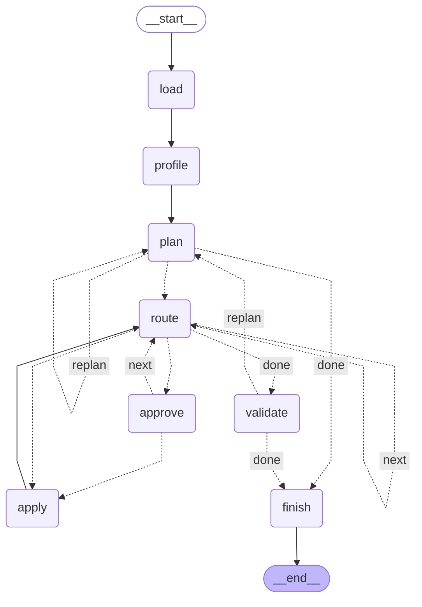

# dataset-triage-agent

A LangGraph agent that cleans a messy CSV with a human in the loop. It
profiles the data, proposes a cleaning plan as typed operations, applies safe
ones automatically, and pauses for approval on anything destructive. Runs
survive a crash and can be replayed from earlier checkpoints. Everything runs
locally on Ollama, on synthetic data.

## Status

Milestones M1–M8 are built and tested: typed ops and executor, the graph
with risk routing, human approval, durable runs, validation with bounded
replanning, replay, an evaluation on synthetic fixtures, and this write-up.
Each milestone's evidence (the command and its result) is in
[`docs/implementation-plan.md`](docs/implementation-plan.md).

It is a two-week project on synthetic data, not a product. The planner fixes
most injected faults with the 27b model and rarely all of them (see
[Evaluation](#evaluation)).

## How it works

The model never writes code. It outputs a `CleaningPlan` of seven typed ops
(`drop_column`, `cast_type`, `impute`, `dedupe`, `filter_rows`,
`standardize_missing`, `strip_whitespace`), validated by pydantic, and a
deterministic executor applies them. Before an op runs, `route` dry-runs it
and measures its impact (rows removed, columns removed, values turned null).
An op over the risk policy goes to `approve`, which pauses the run with
`interrupt()` until a person approves, rejects, or edits it; an edited op goes
back to `route` to be measured again. When the ops run out, `validate` checks
the output, and a failing run goes back to `plan` with the failures as
feedback, up to a retry limit.

The graph, as `graph.get_graph().draw_mermaid()` draws it (regenerate with
`uv run python -m triage.writeup mermaid`; a test fails if this copy drifts).
Dotted edges are conditional; their labels are the `decision` values, and an
unlabelled dotted edge's decision is the target's name.



[`docs/architecture.md`](docs/architecture.md) has the same graph with
readable edge labels, the state, and the trust boundary.

## Demo

A recorded run with `qwen3.8:27b-mlx` on fixture seed 0
([full transcript](docs/demo.md); abridged here). The prompts and output are the CLI's own;
the answers are typed by a script. This is the op that shows why risk is
measured rather than named: the model cast `order_date` with one fixed
format, which would have turned 17 dates written as `3 Jan 2025` into nulls.

```text
Approval needed for #4: cast_type 'order_date'
  reason: The 'order_date' column is a string but represents dates. Casting it to datetime with the observed format (YYYY-MM-DD) enables date-based analysis.
  impact: 17 values nulled
[a]pprove, [r]eject, or [e]dit? e
Replacement op as JSON (same shape as 'op' above): {..., "op":"cast_type","column":"order_date","to":"datetime","datetime_format":null}
edited      #4 cast_type 'order_date' (replaced cast_type)
applied     #4 cast_type 'order_date': 17 values modified
```

The edited op has no fixed format. `route` measured it again, found nothing
turned null, and applied it without asking a second time. The run then asked
about dropping the constant `channel` column and removing 16 duplicates, and
finished `done` with 6 of 8 injected faults fixed: the plan had no op for
the missing ratings or the negative quantities.

Other commands, each covered by tests and a recorded live run in the
implementation plan:

```
uv run python -m triage.cli run <csv> --thread <id>     # plan, ask, apply, validate
uv run python -m triage.cli resume --thread <id>        # continue a stopped or killed run
uv run python -m triage.cli history --thread <id>       # list checkpoints
uv run python -m triage.cli fork --thread <id> --checkpoint <cid>   # re-answer from one
uv run python -m triage.crash_demo --seed 0             # SIGKILL at an approval, then resume
```

## Evaluation

Ten seeded fixtures, each a 200-row orders table with eight injected faults
and a manifest that the planner never sees. Checks judge the output, not the
ops chosen. Two scripted approvers stand in for the person: one approves
everything; the rule-based one rejects large deletions, dropping a column
with more than one value, and deleting rows for a missing value. Every failed
or crashed run counts as zero and stays in the denominator. `think=False`,
one run per fixture
(`uv run python -m triage.evaluate --models qwen3.5:9b-mlx qwen3.8:27b-mlx`):

| Model | Approver | Done / failed / crashed | Faults fixed | Fully cleaned | Approvals asked | Rejected | Replans | Rows wrongly removed | Median s |
|---|---|---|---|---|---|---|---|---|---|
| `qwen3.5:9b-mlx` | approve all | 9 / 1 / 0 | 35/80 | 0/10 | 42 | 0 | 2 | 20 | 15.4 |
| `qwen3.5:9b-mlx` | rule-based | 8 / 2 / 0 | 25/80 | 0/10 | 37 | 4 | 5 | 0 | 15.3 |
| `qwen3.8:27b-mlx` | approve all | 10 / 0 / 0 | 68/80 | 0/10 | 48 | 0 | 0 | 0 | 46.9 |
| `qwen3.8:27b-mlx` | rule-based | 10 / 0 / 0 | 68/80 | 1/10 | 49 | 0 | 1 | 0 | 29.9 |

- The 27b model fixes six fault kinds almost every time. Its misses are
  negative quantities (no `quantity` op in 17 of 20 plans) and missing
  ratings (imputed in 14 of 20).
- The 9b model's wrongly removed rows come from deleting rows with a missing
  region or amount; the rule-based approver rejected those filters, at the
  cost of the nulls they would have removed staying put.
- The evaluation's first run found two bugs, fixed before the run above: the
  profiler counted missing-value markers but showed only five sample values,
  so no plan could name all three markers (0/40 runs fixed that fault, now
  20/20 for 27b); and a malformed `datetime_format` crashed the graph.
- Ten fixtures and MLX's run-to-run variation support counts, not rates.
  Scoring rules, the approvers, and both runs' tables are in
  [`docs/evaluation-plan.md`](docs/evaluation-plan.md) and the
  [M7 section](docs/implementation-plan.md#m7-evaluation-done).

## When LangGraph earned its place

The companion project [`ds-research-agent`](https://github.com/bwu1234/ds-research-agent) decided
against an agent framework for its core loop; this one uses LangGraph. Both
choices are deliberate.

**What LangGraph did here that would otherwise be code to write and test:**

- **Waiting for a person, across processes.** `approve` is about twenty
  lines around `interrupt()`. With `SqliteSaver`, a run killed with SIGKILL
  at an approval prompt resumes in a new process with the question still
  pending (M4, `triage.crash_demo`, `tests/test_durable.py`). By hand that is
  a state store written after every step, a record of the pending question,
  and a resume protocol.
- **Replay.** `cli history` is `get_state_history`; `cli fork` streams from
  an old `checkpoint_id`, and LangGraph saves it as a new branch of the same
  thread, so a person can answer an approval differently and keep both
  outcomes (M6).
- **Routing as data.** The replan loop, the per-op route/approve/apply cycle,
  and the edit path are conditional edges, and the diagram above is generated
  from them rather than drawn.
- **An append-only audit log** via a reducer (`operator.add`), which keeps
  nodes from rewriting each other's entries.

**What it cost, all found while building it:**

- **Nodes re-run from the top on resume.** Anything before `interrupt()` runs
  twice, so `approve` only reads; ops are applied only in `apply`, which is
  idempotent because every file under a run is named by a hash of its inputs.
- **Semantics had to be checked against the source, and are pinned by
  tests.** New input on an interrupted thread restarts at `load` and drops
  the pending question, so `cli run` refuses an existing thread (M4).
  `Command(resume=...)` at an old checkpoint keeps the old answer and ignores
  the new one, so `fork` streams `None` instead (M6).
- **Missing APIs.** There is no supported way to copy a checkpoint chain into
  a new thread, so forks are branches of one thread rather than new runs.
- **Serialization trust.** Checkpoints revive Python objects, so the
  serializer is limited to the state's own types (`STATE_TYPES`), and resume
  values are sent as plain JSON.
- **The LangChain layer.** `with_structured_output`'s parse error quotes the
  whole completion (4 KB once), which went into the audit log and the retry
  prompt until `plan_once` unwrapped it (M5).

**Why `ds-research-agent` does not use it.** Its
[implementation plan](https://github.com/bwu1234/ds-research-agent/blob/main/docs/implementation-plan.md)
(decided 2026-10-04) gives three reasons: the
LangChain MCP adapter requires an `mcp` 1.x client that cannot reach its
retrieval server's protocol version; its loop needs byte-stable prompts for
prefix-cache reuse and Ollama's raw per-step token counts, which calling the
client directly gives without auditing a framework's formatting; and it
needs none of checkpointing, branching, human approval, or multi-agent
coordination, because its run ledger is the checkpoint store. That agent
loop is not built yet, so this is a comparison of designs, not of two
running systems.

**The rule this project suggests:** a graph framework pays for itself when a
run must stop and wait for a person, outlive its process, or branch. Those
three features are most of this project's control flow, and LangGraph made
each one short. A single-process tool loop that records its own ledger gets
little from them and pays the costs above anyway.

## Setup

Requires [uv](https://docs.astral.sh/uv/) and, for model runs, a local
[Ollama](https://ollama.com/) with `qwen3.8:27b-mlx` (the default) or
`qwen3.5:9b-mlx` pulled (`TRIAGE_MODEL__NAME` selects it).

```
uv sync
uv run pytest -q                       # offline checks, no model
uv run pytest -m live                  # calls local Ollama
uv run ruff check .
uv run python -m triage.faults --out fixtures --seeds 0 1 2
```

## Docs

- [`docs/implementation-plan.md`](docs/implementation-plan.md): milestones with evidence, decisions, versions
- [`docs/architecture.md`](docs/architecture.md): graph, state, modules, ops, trust boundary
- [`docs/evaluation-plan.md`](docs/evaluation-plan.md): fixtures, scoring, metrics
- [`docs/demo.md`](docs/demo.md): a recorded run
