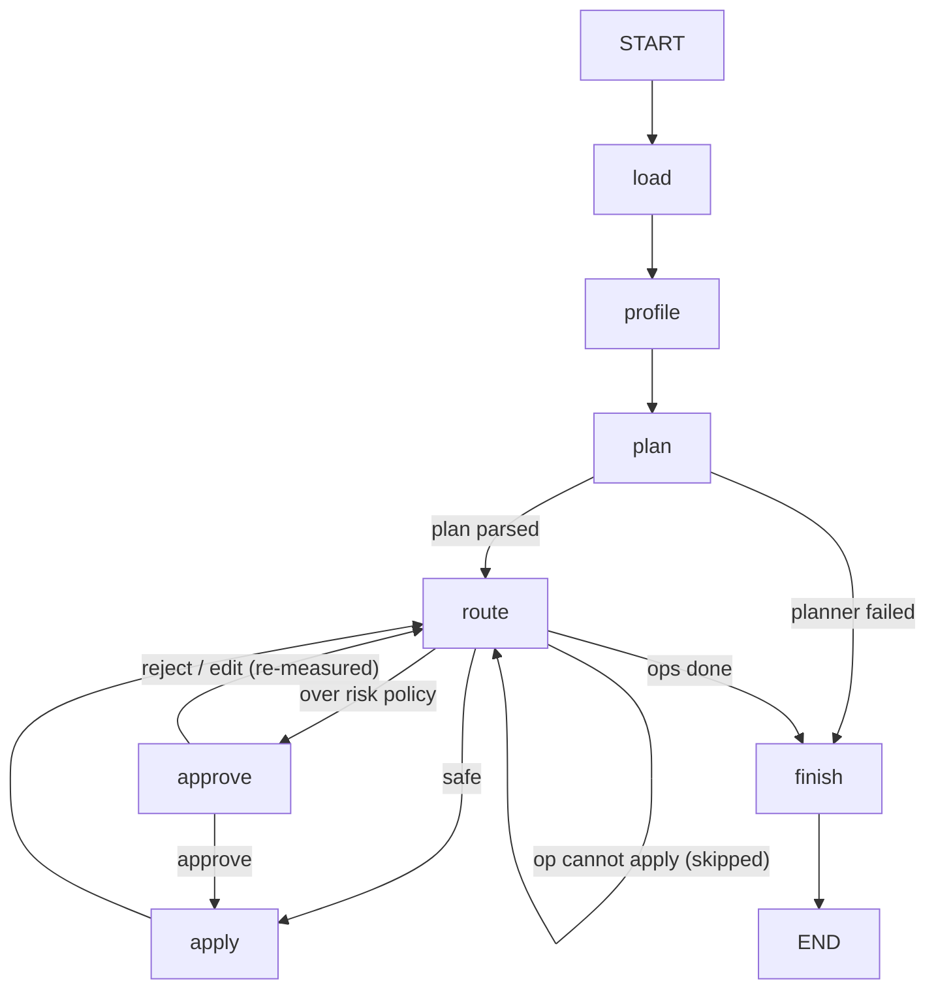
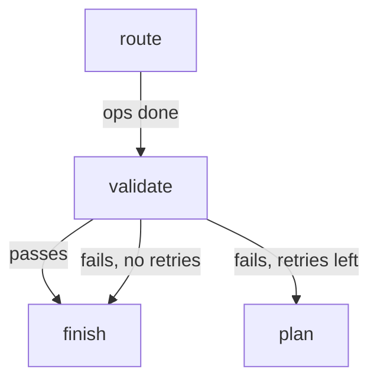

# Architecture

Status markers: **(built)** exists and is tested; **(planned)** does not exist yet.

## Graph

Built (M2–M3); same edges as `graph.get_graph().draw_mermaid()`, with readable labels:

`approve` pauses the run with `interrupt()` and resumes when the CLI sends
`Command(resume=...)` on the same `thread_id`. An edited op returns to
`route` so its own impact is measured before it can be applied.

Planned (M4–M5): `SqliteSaver` replaces `InMemorySaver` so a killed process
resumes where it stopped, and `validate` sits between `route` and `finish`:

## State (built, `triage.graph.State`)

| Field | Type | Notes |
|---|---|---|
| `input_path` | `str` | Source CSV; the only input field |
| `run_dir` | `str` | `Settings.runs_dir / thread_id` |
| `current_path` | `str` | Latest intermediate frame on disk |
| `profile` | `DatasetProfile` | From `triage.profile` |
| `plan` | `CleaningPlan` | From the planner |
| `op_index` | `int` | Next op to route |
| `decision` | `"apply" \| "approve" \| "next" \| "done"` | Set by `route` and `approve` for their conditional edges |
| `audit` | `list[AuditEntry]` | `operator.add` reducer, so nodes append |
| `retries` | `int` | Replans used (M5; always 0 now) |
| `last_error` | `str \| None` | Planner error; fed back to the planner in M5 |
| `status` | `"running" \| "done" \| "failed"` | |
| `output_path` | `str` | `run_dir/cleaned.csv`, set by `finish` |

Frames live on disk, not in state, which keeps checkpoints small. The
checkpointer's serializer is limited to the state's own pydantic types
(`STATE_TYPES`).

## Modules

| Module | Role | Status |
|---|---|---|
| `triage/ops.py` | Seven op models as a pydantic discriminated union; `CleaningPlan` | built |
| `triage/executor.py` | `apply_op`: pure, keeps the row index, raises `OpError` | built |
| `triage/impact.py` | `measure`, `assess` (dry run), `needs_approval` | built |
| `triage/profile.py` | Deterministic profile with per-column fault hints | built |
| `triage/io.py` | `load_csv` with explicit null markers | built |
| `triage/faults.py` | Synthetic dirty fixtures, manifests, outcome checks | built |
| `triage/config.py` | `Settings` via pydantic-settings, `TRIAGE_` env prefix | built |
| `triage/graph.py` | State, nodes (incl. `approve`), edges, compile | built |
| `triage/planner.py` | Prompt and `ChatOllama` structured output, single attempt | built |
| `triage/gate.py` | M2 compatibility gate: parse and apply rate per model | built |
| `triage/cli.py` | `run` (built); `resume`, `history`, `fork` (planned) | partly built |
| `triage/evaluate.py` | Fixture evaluation runner | planned |

## Ops

| Op | Effect | Usually needs approval? |
|---|---|---|
| `drop_column` | Remove a column | Yes (column removed) |
| `cast_type` | Parse to int, float, string, datetime or bool; failures become null | Only if values fail to parse |
| `impute` | Fill nulls by mean, median, mode or a constant | No |
| `dedupe` | Drop duplicate rows | Yes, if any exist |
| `filter_rows` | Keep rows matching a comparison | Yes, if rows are removed |
| `standardize_missing` | Turn marker strings into nulls | Yes (values nulled) |
| `strip_whitespace` | Trim string values | No |

The last column is what the default `RiskPolicy` produces. Approval is decided
from measured impact, so the same op can go either way depending on the data.

## Trust boundary

Profile sample values come from the file and are untrusted text. The planner
prompt presents them as data. Ops are validated against the schema before
anything runs, and unknown ops or extra fields are rejected, so text in a
data file cannot add an operation the schema doesn't define.

The fixture manifests are answer keys. They stay out of the planner's input.
