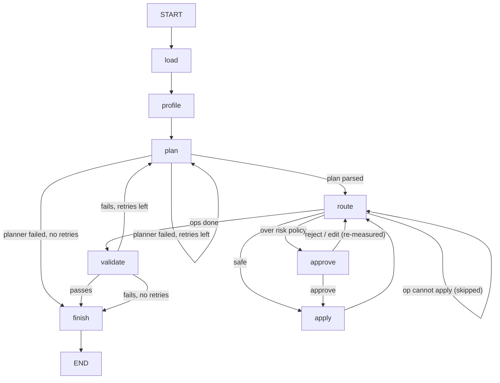

# Architecture

Status markers: **(built)** exists and is tested; **(planned)** does not exist yet.

## Graph

Built (M2–M5); same edges as `graph.get_graph().draw_mermaid()`, with readable labels:

`approve` pauses the run with `interrupt()` and resumes when the CLI sends
`Command(resume=...)` on the same `thread_id`. An edited op returns to
`route` so its own impact is measured before it can be applied.

The CLI checkpoints every step to `SqliteSaver` at `Settings.checkpoint_db`
(`open_checkpointer`), so `cli resume` continues a stopped or killed run in a
new process: it answers a pending `interrupt()`, or re-runs the node that was
in progress (`apply` reuses its content-keyed output file). `cli run` refuses
an existing thread, because new input on a thread restarts at `load` and drops
any pending approval.

`cli history` lists a thread's checkpoints (`get_state_history`) and `cli
fork` runs the thread again from one of them, as a new branch of the same
thread: it streams `None` with that `checkpoint_id`, which LangGraph treats
as time travel, so a pending approval is asked again rather than answered
with the old value. Every file under `run_dir` is content-keyed
(`step_000_<key>.pkl`, `step_<n>_<op_key>.pkl`, `cleaned_<key>.csv`), so
branches never overwrite each other's frames or output.

`validate` (`triage.validate.check_output`) compares the output with the
loaded file and fails on: an op skipped with `OpError`; more than
`ValidationPolicy.max_rows_removed_fraction` of rows removed in total; a
column with more new nulls than applied ops on it account for; a cast's
target dtype undone by a later op. Casts a person rejected are not checked.
A failure goes back to `plan` with feedback (previous plan, failures, ops a
person rejected), and the new plan starts again from `start_path`, so earlier
ops are not stacked on. Planner parse and transport failures use the same
`max_plan_retries` budget; their error is summarised and capped
(`ModelConfig.max_error_chars`) rather than quoting the reply. When a replan
proposes an op a person already answered, on the same input bytes, `route`
reuses that answer (`RiskPolicy.reuse_decisions`). Out of retries, the run finishes `failed` with no
`cleaned_*.csv`.

## State (built, `triage.graph.State`)

| Field | Type | Notes |
|---|---|---|
| `input_path` | `str` | Source CSV; the only input field |
| `run_dir` | `str` | `Settings.runs_dir / thread_id` |
| `start_path` | `str` | The loaded frame (`step_000_<key>.pkl`); each plan attempt starts here |
| `current_path` | `str` | Latest intermediate frame on disk |
| `profile` | `DatasetProfile` | From `triage.profile` |
| `plan` | `CleaningPlan` | From the planner |
| `op_index` | `int` | Next op to route |
| `decision` | `"route" \| "replan" \| "apply" \| "approve" \| "next" \| "done"` | Set by `plan`, `route`, `approve` and `validate` for their conditional edges |
| `audit` | `list[AuditEntry]` | `operator.add` reducer, so nodes append |
| `retries` | `int` | Planner calls after the first (parse or validation failures) |
| `last_error` | `str \| None` | Why the last plan failed; fed back to the next planner call |
| `decisions` | `dict[str, "approve" \| "reject"]` | A person's answers by `op_key` (input bytes + op without `reason`), reused when a replan meets the same op on the same data |
| `status` | `"running" \| "done" \| "failed"` | |
| `output_path` | `str` | `run_dir/cleaned_<key>.csv`, keyed on the final frame; set by `finish` |

Frames live on disk, not in state, which keeps checkpoints small. The
checkpointer's serializer is limited to the state's own pydantic types
(`STATE_TYPES`).

## Modules

| Module | Role | Status |
|---|---|---|
| `triage/ops.py` | Seven op models as a pydantic discriminated union; `CleaningPlan` | built |
| `triage/executor.py` | `apply_op`: pure, keeps the row index, raises `OpError` | built |
| `triage/impact.py` | `measure`, `assess` (dry run), `needs_approval` | built |
| `triage/profile.py` | Deterministic profile with per-column fault hints | built |
| `triage/io.py` | `load_csv` with explicit null markers | built |
| `triage/faults.py` | Synthetic dirty fixtures, manifests, outcome checks | built |
| `triage/config.py` | `Settings` via pydantic-settings, `TRIAGE_` env prefix | built |
| `triage/graph.py` | State, nodes (incl. `approve`), edges, compile | built |
| `triage/planner.py` | Prompt and `ChatOllama` structured output, single attempt | built |
| `triage/gate.py` | M2 compatibility gate: parse and apply rate per model | built |
| `triage/cli.py` | `run`, `resume`, `history`, `fork` | built |
| `triage/validate.py` | `check_output`: invariants on a finished run's output | built |
| `triage/crash_demo.py` | M4 demo: SIGKILL a run at its first approval, resume it in a new process | built |
| `triage/evaluate.py` | Fixture evaluation: scripted approvers, scoring against manifests | built |
| `triage/writeup.py` | README Mermaid diagram and the recorded demo (`docs/demo.md`) | built |

## Ops

| Op | Effect | Usually needs approval? |
|---|---|---|
| `drop_column` | Remove a column | Yes (column removed) |
| `cast_type` | Parse to int, float, string, datetime or bool; failures become null | Only if values fail to parse |
| `impute` | Fill nulls by mean, median, mode or a constant | No |
| `dedupe` | Drop duplicate rows | Yes, if any exist |
| `filter_rows` | Keep rows matching a comparison | Yes, if rows are removed |
| `standardize_missing` | Turn marker strings into nulls | Yes (values nulled) |
| `strip_whitespace` | Trim string values | No |

The last column is what the default `RiskPolicy` produces. Approval is decided
from measured impact, so the same op can go either way depending on the data.

## Trust boundary

Profile sample values come from the file and are untrusted text. The planner
prompt presents them as data. Replan feedback quotes column names, values and
`OpError` messages from the same file, so it is fenced the same way
(`<feedback>`). Ops are validated against the schema before
anything runs, and unknown ops or extra fields are rejected, so text in a
data file cannot add an operation the schema doesn't define.

The fixture manifests are answer keys. They stay out of the planner's input.
